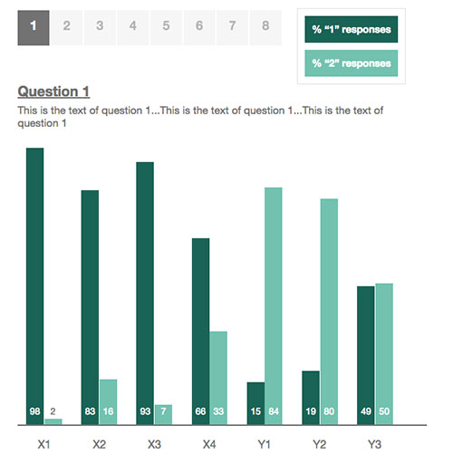

##Practical data viz in JavaScript

Let's make an interactive bar chart using JavaScript


####First things first

* [Highcharts](http://www.highcharts.com/) (lots of parameters to make minor changes) 
* [Google Charts](https://developers.google.com/chart/) (robust but constantly changing)
* [D3](https://d3js.org/) (steep learning curve)

**So why JavaScript? Actually, it’s [jQuery](https://jquery.com/), a JavaScript library with simpler syntax and less code than plain ol' JavaScript**

Hosted jQuery: [http://ajax.googleapis.com/ajax/libs/jquery/1.11.0/jquery.min.js](http://ajax.googleapis.com/ajax/libs/jquery/1.11.0/jquery.min.js)

_jQuery_
```javascript
$(‘body’) .css (‘background’, ‘red’); 
```

_JavaScript_
```javascript
Function changeBackground(color) {
}
Document.body.style.background = color;
}
Onload = "changeBackground('red');"
```

####Let's get crackin'

A pollster administered an online survey and collected 19,999 sets of responses
to eight questions. Participants were assigned to one of seven groups and could
answer 1, 2, or 0 (No Response) to each question.


**The goal:** 
Design a chart to allow readers to compare all groups’ responses of 1 or 2 to all eight questions



_First taught at NICAR 2016, Denver by [Dana Amihere](https://twitter.com/write_this_way)_
